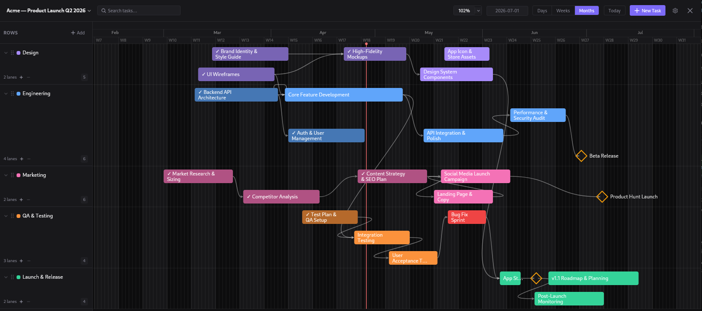
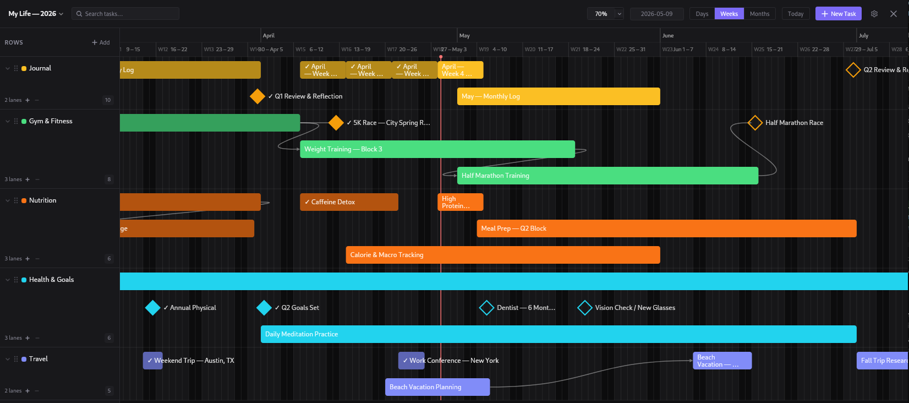

# trelline

A lightweight, offline-first timeline app. Inspired by Asana's Timeline view - built as a native desktop app so your data stays on your machine.

No subscriptions. No accounts. No cloud. Your tasks are plain JSON files in a folder you control. Nothing leaves your machine unless you let it.

Works for project planning, logging personal activities with time-based and cause-and-effect visuals, or charting historical sequences event by event. And since every workspace is just a folder of plain JSON, you can drop it straight into an LLM for full context on your timeline.

---

<p align="center">
  
  
</p>

---

## Features

- **Fully offline** — no network requests, no backend, no database process
- **Import from Asana** — import via JSON (preserves milestones, sections, completion status) or CSV (preserves partial dependency links); sections become rows, tasks are greedy-packed into lanes so non-overlapping tasks share a row
- **Custom SVG timeline canvas** — task bars, drag-to-move, drag-to-resize, all snapping to day boundaries
- **Dependency arrows** — draw finish-to-start dependencies between tasks across any row
- **Sub-lanes** — overlapping tasks stack automatically within a row; drag to reorder
- **Milestones** — render as diamonds on the canvas
- **Zoom levels** — Days, Weeks, Months; scroll position persists per workspace
- **Canvas scale** — 50–200% zoom via controls or the scale picker in the top bar
- **Rich text task notes** — full formatting in the task detail panel
- **Row management** — add, rename, reorder, delete rows; collapsible rows
- **Canvas search** — find tasks by name
- **Settings** — scroll direction, date format, week start day
- **Onboarding tutorial** — interactive spotlight tour on first launch; restartable from settings

### Controls

| Input | Action |
|---|---|
| `Ctrl+Z` | Undo |
| `Ctrl+Y` | Redo |
| `Ctrl+Scroll` | Zoom canvas in / out |
| `Ctrl +/-` | Zoom canvas in / out |
| `Ctrl+Drag` or `Middle Mouse+Drag` on empty canvas | Marquee select — move or delete tasks as a group |

---

## Download

Grab the latest installer for your platform from the [Releases](https://github.com/apakr/trelline/releases) page.

| Platform | Format |
|---|---|
| Linux | `.deb`, `.AppImage` |
| Windows | `.msi`, `.exe` |
| macOS (Apple Silicon + Intel) | `.dmg` |

---

## Build from source

**Prerequisites:** [Node.js](https://nodejs.org/) 18+, [Rust](https://rustup.rs/) (stable), and the [Tauri prerequisites](https://tauri.app/start/prerequisites/) for your OS.

```bash
git clone https://github.com/apakr/trelline.git
cd trelline
npm install
npm run tauri build
```

The compiled installer will be in `src-tauri/target/release/bundle/`.

To run in development mode with hot-reload:

```bash
npm run tauri dev
```

---

## Data format

A workspace is just a folder on your filesystem:

```
my-workspace/
  workspace.json      # rows, zoom level, scroll position
  tasks/
    task_<uuid>.json  # one file per task
```

All files are human-readable JSON. You can open them in any text editor, back them up with any tool, or version-control them with git.

---

## Tech stack

| Layer | Choice |
|---|---|
| Desktop shell | Tauri 2 (Rust) |
| Frontend | React 19 + TypeScript |
| Timeline rendering | Custom SVG — no Gantt library |
| Styling | Tailwind CSS |
| Data | JSON files via `@tauri-apps/plugin-fs` |

---

## Status

Stable release. Core functionality is complete. The app checks for updates on launch and shows a notification when a new version is available.
